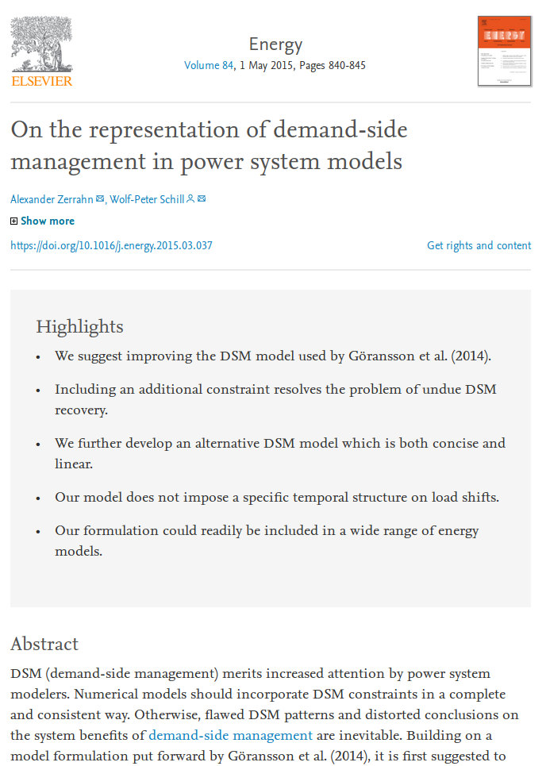

---
author:
- Guido Pleßmann
- Julian Endres
title: DSM modeling in oemof.solph
subtitle: Introducing the custom component SinkDSM
institute: Reiner Lemoine Institut
classoption: aspectratio=169
date: December 6, 2019
theme: rli
header-includes: 
- |
  \tikzset{
  invisible/.style={opacity=0},
  visible on/.style={alt={#1{}{invisible}}},
  alt/.code args={<#1>#2#3}{%
    \alt<#1>{\pgfkeysalso{#2}}{\pgfkeysalso{#3}} % \pgfkeysalso doesn't change the path
  },
  }
  \newcommand{\tel}{+49 (0)30 1208 434 72}
  \newcommand{\email}{guido.plessmann@rl-institut.de}
  \newcommand{\twitter}{\href{https://twitter.com/gplssm}{@gplssm}}
  \newcommand{\finalstatement}{}
  \hypersetup{colorlinks,urlcolor=rlilinkcolor}
...

# Project context

* Research project WindNODE
* Building a regional ESM for Anhalt-Bitterfeld-Wittenberg
* Intended analysis: potential of flexibility options to foster regional energy supply
* Demand-Side Management in households is one option

\vspace{10pt}

Code (under development): [https://github.com/windnode/WindNODE_ABW](https://github.com/windnode/WindNODE_ABW)

# A minimal testing energy system

:::::: {.columns}
::: {.column  width=45%} 
\begin{tikzpicture}

\tikzstyle{icon} = [inner sep=0pt];
\tikzstyle{flow} = [ultra thick, inner sep=0pt];

\coordinate (busTop) at (0.5\paperwidth,0.8\paperheight);
\coordinate (busBottom) at (0.5\paperwidth,0.3\paperheight);

\node (elecbus) at ($(busBottom) - (0,.5)$) {Household busbar};
\draw[line width=4pt](busTop) -- (busBottom);

\node[icon,draw,very thick, rounded corners=0.5ex, inner sep=3pt,visible on=<5->](dsm) at ($(busTop)!0.5!(busBottom) - (1,0)$) {{\visible<5->{\includegraphics[width=.8cm]{img/noun_filter_1653638.pdf}}}};
\node[icon](demand) at ($(busTop)!0.5!(busBottom) - (2.5,0)$) {{\visible<2->{\includegraphics[width=1.1cm]{img/Verbraucher_Haushalt_Strom.pdf}}}};
\node[icon](grid) at ($(busTop)!0.7!(busBottom) + (1,0)$) {{\visible<4->{\includegraphics[width=1.1cm]{img/Transport_Strom.pdf}}}};
\node[icon](pv) at ($(busTop)!0.3!(busBottom) + (1,0)$) {{\visible<3->{\includegraphics[width=1.1cm]{img/Stromerzeuger_Photovoltaik_Dachanlage.pdf}}}};

\draw[<-,flow, visible on=<5->](dsm) -- ($(busTop)!0.5!(busBottom)$);
\draw[->,flow, visible on=<5->](dsm) -- (demand);
\draw[<-,flow, visible on=<4->] ($(busTop)!0.7!(busBottom) + (2pt,0)$) -- (grid);
\draw[<-,flow, visible on=<3->] ($(busTop)!0.3!(busBottom) + (2pt,0)$) -- (pv);

\end{tikzpicture}
:::

::: {.column  width=40%}
**Assuming we have a household including**

\begin{itemize}
\item<2-> Demand
\item<3-> PV
\item<4-> Grid connection
\item<5-> Demand-side management unit
\end{itemize}

:::
::::::

# Create some data

~~~ python
# Create some data
pv_day = [(-(1 / 6 * x ** 2) + 6) / 6 for x in range(-6, 7)]
pv_ts = [0] * 6 + pv_day + [0] * 6
data_dict = {"demand_el": [3] * len(pv_ts),
             "pv": pv_ts,
             "Cap_up": [0.5] * len(pv_ts),
             "Cap_do": [0.5] * len(pv_ts)}
data = pd.DataFrame.from_dict(data_dict)

# Do timestamp stuff
datetimeindex = pd.date_range(start='1/1/2013', periods=len(data.index), 
  freq='H')
data['timestamp'] = datetimeindex
data.set_index('timestamp', inplace=True)
~~~

# Surrounding minimal energy system 

~~~ python
es = solph.EnergySystem(timeindex=datetimeindex)
Node.registry = es

b_elec = solph.Bus(label='Electricity bus')

grid = solph.Source(
	label='Grid',
	outputs={b_elec: solph.Flow(nominal_value=10000,variable_costs=50)})

pv = solph.Source(
	label='pv',
	outputs={b_elec: solph.Flow(actual_value=data['pv'], fixed=True, 
    nominal_value=3.5)})
~~~

# SinkDSM component

~~~ python
# Create DSM Sink
demand_dsm = solph.custom.SinkDSM(label='DSM',
                                  inputs={b_elec: solph.Flow()},
                                  capacity_up=data['Cap_up'],
                                  capacity_down=data['Cap_do'],
                                  delay_time=6,
                                  demand=data['demand_el'],
                                  method="delay",
                                  cost_dsm_down=5)
~~~

# {.plain}

\centering
{ width=85% }

# How to model DSM?

\center

# DSM formualtion 1: Zerrahn \& Schill (delay)

\vspace{-17pt}
\begin{align}
\onslide<1->{\quad \dot{E}_{t} = demand_{t} + DSM_{t}^{up} - \sum_{tt=t-L}^{t+L} DSM_{t,tt}^{do}  \quad \forall t \in \mathbb{T}\\}
\onslide<2->{\quad DSM_{t}^{up} = \sum_{tt=t-L}^{t+L} DSM_{t,tt}^{do} \quad \forall t \in \mathbb{T}\\}
\onslide<3->{\quad DSM_{t}^{up} \leq  E_{t}^{up} \quad \forall t \in \mathbb{T}\\}
\onslide<4->{\quad \sum_{t=tt-L}^{tt+L} DSM_{t,tt}^{do}  \leq E_{tt}^{do} \quad \forall tt \in \mathbb{T}\\}
\onslide<5>{\quad DSM_{t}^{up}  + \sum_{t=tt-L}^{tt+L} DSM_{t,tt}^{do} \leq max \{ E_{tt}^{up}, E_{tt}^{do} \}\quad \forall tt \in \mathbb{T}\\}
\notag
\end{align}

# Basic testing data

# How it works

:::::: {.columns}
::: {.column  width=45%} 

:::

::: {.column  width=40%}
**Delay time:** 3

\vspace{10pt}

**What's happening**

- Interrupted wind generation in hour 4 set 100 MWh on hold
- Doubled wind generation in hour 7 compensates for demand that is set on hold
- Doubled wind generation around afternoon on the second day goes to excess
:::
:::::: 

# Shifting energy exceeding the delay time (basic)

:::::: {.columns}
::: {.column  width=45%} 

:::

::: {.column  width=40%}
**Delay time:** 1

\vspace{10pt}

**What's happening**

- DSM allows to shift energy from first day morning to second day afternoon. How is that possible?
- Zerrahn et al.'s (2015) constraints allow to trigger $DSM^{up}$ and $DSM^{do}$ at the same time
- $DSM^{up}$ and $DSM^{do}$ are constrained to the tighter bound (Eq. (5))
:::
:::::: 

# Limited by DSM events in between (50 %)

:::::: {.columns}
::: {.column  width=45%} 

:::

::: {.column  width=40%}
**Delay time:** 1

\vspace{10pt}

**Intermediate DSM trigger:**\
50 % of $DSM_{up}$

\vspace{10pt}

**What's happening**

- DSM activity in the morning of the first day: 50 MWh
- DSM shift that exceeds the delay time is limited: 50 MWh $\rightarrow$ 25 MWh
:::
:::::: 

# Effect of delay time

:::::: {.columns}
::: {.column  width=45%} 

:::

::: {.column  width=40%}
**Delay time:** 1

\vspace{10pt}

**What's happening**

- DSM shift exceeding the delay of 50 MWh
:::
::::::

# Effect of delay time

:::::: {.columns}
::: {.column  width=45%} 

:::

::: {.column  width=40%}
**Delay time:** 2

\vspace{10pt}

**What's happening**

- Longer delay times allow for more DSM shifts exceeding the delay time
:::
::::::

# Effect of delay time

:::::: {.columns}
::: {.column  width=45%} 

:::

::: {.column  width=40%}
**Delay time:** 3

\vspace{10pt}

**What's happening**

- ...and more
:::
::::::

# Effect of delay time

:::::: {.columns}
::: {.column  width=45%} 

:::

::: {.column  width=40%}
**Delay time:** 6

\vspace{10pt}

**What's happening**

- and even more

\vspace{10pt}

\onslide<2->{\bfseries{But...\\}}
\onslide<2->{the modeler interprets his/her results!}
:::
::::::

# DSM modeling for households

Available data: technical DSM potential for groups of households

\center
{ width=85% }

<!-- Two DSM model formulations are provided by [SinkDSM](https://oemof.readthedocs.io/en/latest/api/oemof.solph.html#oemof.solph.custom.SinkDSM) -->

# DSM potential

\center
{ width=75% }

# DSM formulation 2: Interval

The dataset for DSM potential does not allow to shift energy across days!

\begin{align}
\onslide<2->{\quad \dot{E}_{t} = demand_{t} + DSM_{t}^{up} - DSM_{t}^{do}  \quad \forall t \in \mathbb{T}\\}
\onslide<3->{\quad  DSM_{t}^{up} \leq E_{t}^{up} \quad \forall t \in \mathbb{T}\\}
\onslide<4->{\quad DSM_{t}^{do} \leq  E_{t}^{do} \quad \forall t \in \mathbb{T}\\}
\onslide<5->{\quad  \sum_{t=t_s}^{t_s+\tau} DSM_{t}^{up} = \sum_{t=t_s}^{t_s+\tau}
        DSM_{t}^{do} \quad \forall t_s \in \{k \in \mathbb{T} \mid k \mod \tau = 0\}\\}
\notag
\end{align}

\onslide<6->Using $\tau = 1$ sets the window for DSM activity to exactly one day.

# Comparing both formulations -- delay method

\center
{ width=67% }

# Comparing both formulations -- interval method

\center
{ width=67% }

# DSM energy on hold

\center

# Comparison by numbers

|                                                           | demand\_el | dsm\_tot | excess | cap\_up | cap\_do | wind |   pv | coal |
| :-------------------------------------------------------- | ---------: | -------: | -----: | ------: | ------: | ---: | ---: | ----: |
| 1 HH 3 P. [delay] |       91.0 |     18.0 |   43.0 |   109.0 |    34.0 |  96.0 | 15.0 |  23.0 |
| 10 HH           |       92.0 |     14.0 |   42.0 |    59.0 |    27.0 |  96.0 | 15.0 |  22.0 |
| 50 HH [delay]           |       89.0 |     13.0 |   43.0 |    57.0 |    27.0 |  96.0 | 15.0 |  21.0 |
| 100 HH [delay]          |       88.0 |     13.0 |   44.0 |    53.0 |    26.0 |  96.0 | 15.0 |  21.0 |
| 1 HH 3 P. [interval] |       91.0 |     18.0 |   44.0 |   109.0 |    34.0 |   96.0 | 15.0 |  24.0 |
| 10 HH [interval]        |       92.0 |     12.0 |   43.0 |    59.0 |    27.0 |   96.0 | 15.0 |  23.0 |
| 50 HH [interval]        |       89.0 |     11.0 |   44.0 |    57.0 |    27.0 |  96.0 | 15.0 |  22.0 |
| 100 HH [interval]      |       88.0 |     11.0 |   45.0 |    53.0 |    26.0 |  96.0 | 15.0 |  22.0 |

# Discussion

#. Who plans to model DSM with oemof.solph in the near future? 
#. Further development of `SinkDSM`
   - Move to `solph.Components` by v0.4.0?
   - Responsibility for `SinkDSM`?
   - Roadmap

# {.plain}

\insertendpagecontent