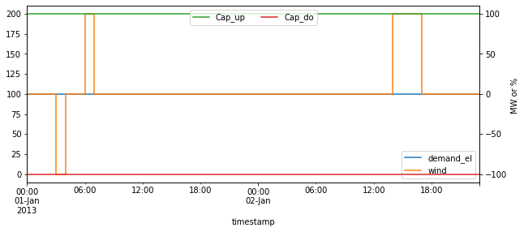
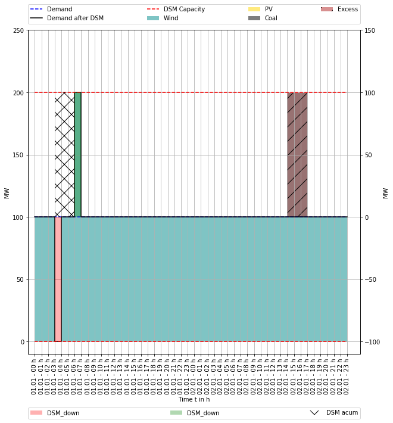
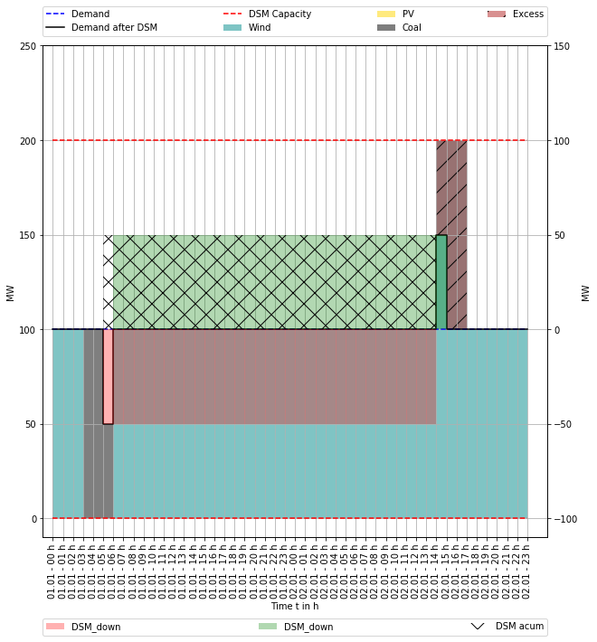
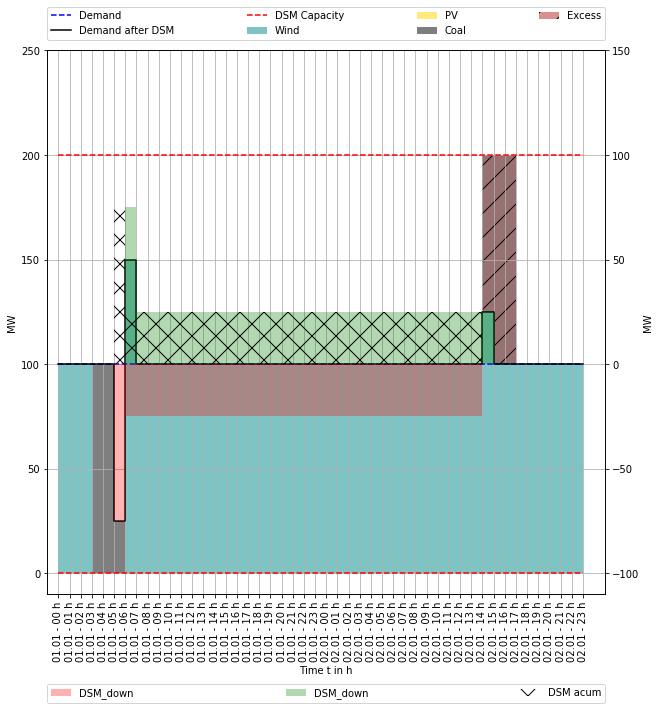
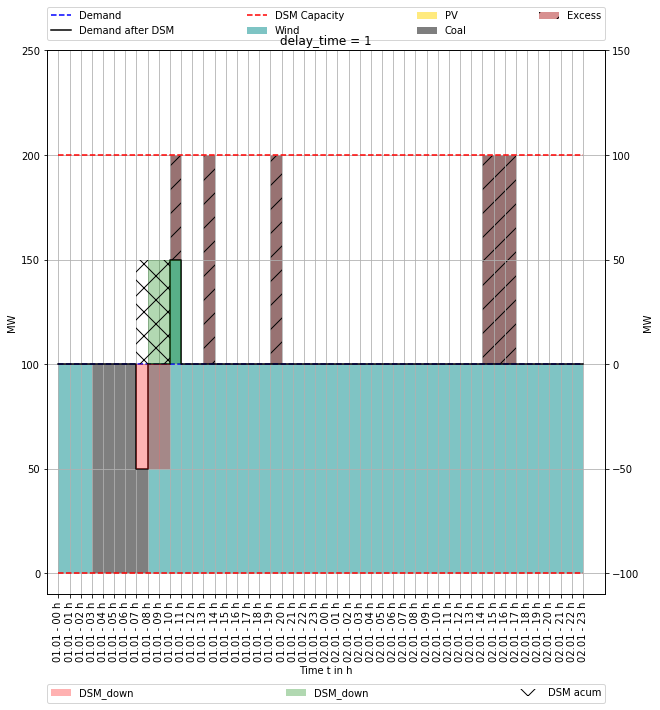
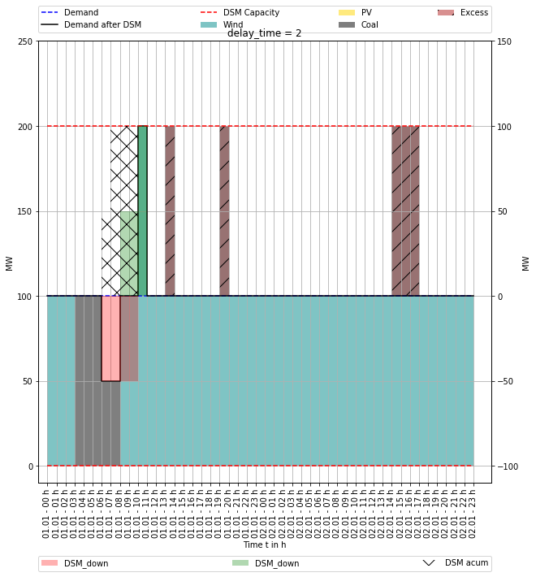
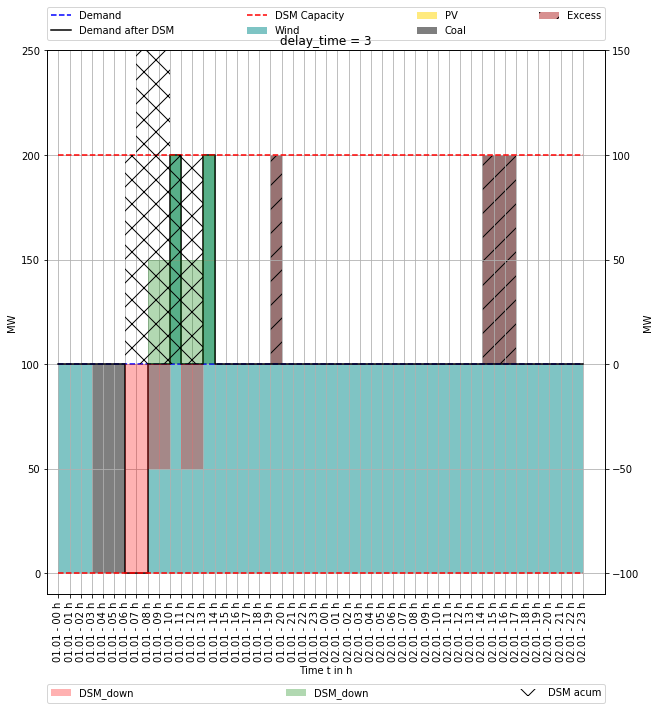
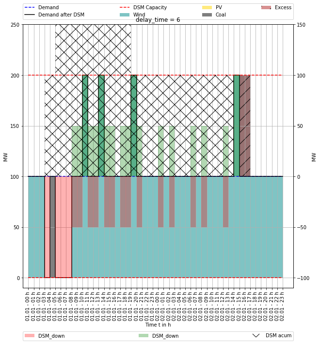
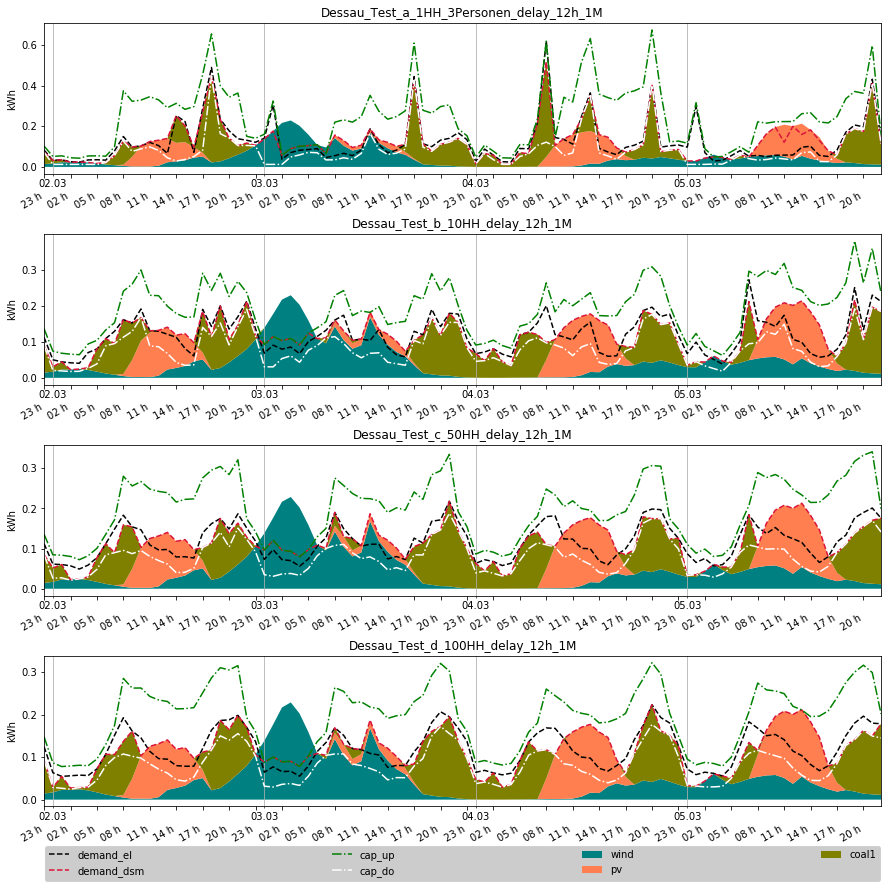

---
author:
- Guido Pleßmann
- Julian Endres
title: DSM modeling in oemof.solph
subtitle: Introducing the custom component SinkDSM
institute: Reiner Lemoine Institut
classoption: aspectratio=169
date: December 6, 2019
theme: rli
...

# A minimal testing energy system

\begin{tikzpicture}

\coordinate (busTop) at (0.5\paperwidth,0.8\paperheight);
\coordinate (busBottom) at (0.5\paperwidth,0.3\paperheight);

\draw[line width=4pt] (busTop) -- (busBottom);
\node (elecbus) at ($(busTop) + (0,1)$) {\sffamily\bfseries Electricity bus};

\node (demand) at ($(busTop)!0.5!(busBottom) - (1,0)$) {\includegraphics[width=1.1cm]{img/Verbraucher_Haushalt_Strom.pdf}};
\node (grid) at ($(busTop)!0.3!(busBottom) + (1,0)$) {\includegraphics[width=1.1cm]{img/Transport_Strom.pdf}};
\node (pv) at ($(busTop)!0.7!(busBottom) + (1,0)$) {\includegraphics[width=1.1cm]{img/Stromerzeuger_Photovoltaik_Dachanlage.pdf}};

\draw[<-,ultra thick, inner sep=2pt] (demand) -- ($(busTop)!0.5!(busBottom)$);

\end{tikzpicture}

# {.plain}

\centering
{ width=85% }

# The code -- data

~~~ python
# Create some data
pv_day = [(-(1 / 6 * x ** 2) + 6) / 6 for x in range(-6, 7)]
pv_ts = [0] * 6 + pv_day + [0] * 6
data_dict = {"demand_el": [3] * len(pv_ts),
             "pv": pv_ts,
             "Cap_up": [0.5] * len(pv_ts),
             "Cap_do": [0.5] * len(pv_ts)}
data = pd.DataFrame.from_dict(data_dict)

# Do timestamp stuff
datetimeindex = pd.date_range(start='1/1/2013', periods=len(data.index), freq='H')
data['timestamp'] = datetimeindex
data.set_index('timestamp', inplace=True)
~~~

# Surrounding minimal energy system 

~~~ python
es = solph.EnergySystem(timeindex=datetimeindex)
Node.registry = es

b_elec = solph.Bus(label='Electricity bus')

grid = solph.Source(
	label='Grid',
	outputs={b_elec: solph.Flow(nominal_value=10000,variable_costs=50)})

pv = solph.Source(
	label='pv',
	outputs={b_elec: solph.Flow(actual_value=data['pv'], fixed=True, nominal_value=3.5)})
~~~

# SinkDSM component

~~~ python
# Create DSM Sink
demand_dsm = solph.custom.SinkDSM(label='DSM',
                                  inputs={b_elec: solph.Flow()},
                                  capacity_up=data['Cap_up'],
                                  capacity_down=data['Cap_do'],
                                  delay_time=6,
                                  demand=data['demand_el'],
                                  method="delay",
                                  cost_dsm_down=5)
~~~

# Project context

* Research project WindNODE
* Building a regional ESM for Anhalt-Bitterfeld-Wittenberg
* Intended analysis: potential of flexibility options to foster regional energy supply
* Demand-Side Management in households is one option

# DSM modeling for households

Available data: technical DSM potential for groups of households

{ width=85% }

<!-- Two DSM model formulations are provided by [SinkDSM](https://oemof.readthedocs.io/en/latest/api/oemof.solph.html#oemof.solph.custom.SinkDSM) -->

# DSM potential

{ width=85% }

# DSM formualtion 1: Zerrahn \& Schill (interval)

\vspace{-17pt}
\begin{equation}
\quad \dot{E}_{t} = demand_{t} + DSM_{t}^{up} - \sum_{tt=t-L}^{t+L} DSM_{t,tt}^{do}  \quad \forall t \in \mathbb{T}
\end{equation}

\begin{equation}
\quad DSM_{t}^{up} = \sum_{tt=t-L}^{t+L} DSM_{t,tt}^{do} \quad \forall t \in \mathbb{T}
\end{equation}

\begin{equation}
\quad DSM_{t}^{up} \leq  E_{t}^{up} \quad \forall t \in \mathbb{T}
\end{equation}

\begin{equation}
\quad \sum_{tt=t-L}^{t+L} DSM_{t,tt}^{do}  \leq E_{t}^{do} \quad \forall t \in \mathbb{T}\end{equation}

\begin{equation}
\quad DSM_{t}^{up}  + \sum_{tt=t-L}^{t+L} DSM_{t,tt}^{do} \leq max \{ E_{t}^{up}, E_{t}^{do} \}\quad \forall t \in \mathbb{T}
\end{equation}

# DSM formulation 2: Interval

The dataset for DSM potential does not allow to shift energy across days!

\begin{equation}
\quad \dot{E}_{t} = demand_{t} + DSM_{t}^{up} - DSM_{t}^{do}  \quad \forall t \in \mathbb{T}
\end{equation}

\begin{equation}
\quad  DSM_{t}^{up} \leq E_{t}^{up} \quad \forall t \in \mathbb{T}
\end{equation}

\begin{equation}
\quad DSM_{t}^{do} \leq  E_{t}^{do} \quad \forall t \in \mathbb{T}
\end{equation}

\begin{equation}
\quad  \sum_{t=t_s}^{t_s+\tau} DSM_{t}^{up} = \sum_{t=t_s}^{t_s+\tau}
        DSM_{t}^{do} \quad \forall t_s \in \{k \in \mathbb{T} \mid k \mod \tau = 0\}
\end{equation}

# Basic testing data

# How it works

:::::: {.columns}
::: {.column  width=45%} 

:::

::: {.column  width=40%}
**Delay time:** ??

\vspace{10pt}

**What's happening**
:::
:::::: 

# Shifting energy exceeding the delay time (basic)

:::::: {.columns}
::: {.column  width=45%} 

:::

::: {.column  width=40%}
**Delay time:** ??

\vspace{10pt}

**What's happening**
:::
:::::: 

# Limited by DSM events in between (50 %)

:::::: {.columns}
::: {.column  width=45%} 

:::

::: {.column  width=40%}
**Delay time:** ??

\vspace{10pt}

**Intermediate DSM trigger:**\
50 % of $DSM_{up}$

\vspace{10pt}

**What's happening**
:::
:::::: 

# Effect of delay time

:::::: {.columns}
::: {.column  width=45%} 

:::

::: {.column  width=40%}
**Delay time:** 1

\vspace{10pt}

**What's happening**
:::
::::::

# Effect of delay time

:::::: {.columns}
::: {.column  width=45%} 

:::

::: {.column  width=40%}
**Delay time:** 2

\vspace{10pt}

**What's happening**
:::
::::::

# Effect of delay time

:::::: {.columns}
::: {.column  width=45%} 

:::

::: {.column  width=40%}
**Delay time:** 3

\vspace{10pt}

**What's happening**
:::
::::::

# Effect of delay time

:::::: {.columns}
::: {.column  width=45%} 

:::

::: {.column  width=40%}
**Delay time:** 6

\vspace{10pt}

**What's happening**
:::
::::::

# Comparing both formulations -- delay method

